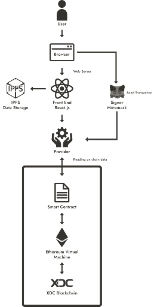
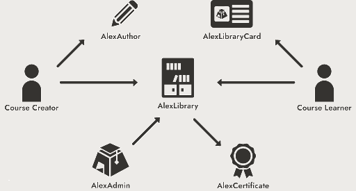

<div align="center">
  <a href="[https://github.com/othneildrew/Best-README-Template](https://github.com/Alexandria-Decentralized-L2E-Platform/Alexandria/)">
    
  </a>

  <h3 align="center">Alexandria</h3>

  <p align="center">
A decentralized, community driven, self-serviced, <strong>Learn-to-Earn</striong> platform operation on the principles of accessibility, incentivization, decentralization.    <br />
    <a href="https://alexandria-orcin.vercel.app"><strong>View Live Demo »</strong></a> <br />
    <a href="https://alexandria-orcin.vercel.app"><strong>View White Paper »</strong></a> <br />
    <a href="https://alexandria-orcin.vercel.app"><strong>View Demo Video »</strong></a>
  </p>
</div>

## Protocol Overview

### Dapp Architecture



The provided diagram illustrates the architecture of the protocol, with React.js as the chosen frontend development framework. Data storage, including course descriptions, content URLs, questions, multiple-choice options, and additional metadata, is securely stored on IPFS through the Pinata gateway. The resulting Content Identifier (CID) is then registered within our core smart contracts. Data extraction from the blockchain is facilitated by a dedicated RPC endpoint provider, diverging from Metamask's provider. Metamask exclusively handles user address retrieval and the submission of signed transactions to the blockchain.

### Smart Contracts



There are 5 [smart contracts](https://github.com/Alexandria-Decentralized-L2E-Platform/Alexandria/tree/main/contracts/contracts) created for this protocol:

1. **AlexAuthor:** This ERC-721 contract provides evidence of eligibility to initiate a course within the protocol. To deter misuse, minting this NFT might require ALEX tokens, promoting responsible usage. The initial fee structure is set at zero to ensure a smooth entry into the system.

2. **AlexLibraryCard:** Operating as a cornerstone of eligibility verification, AlexLibraryCard (ERC-721)confirms a user's rightful access to reap rewards from the protocol. Similar to AlexAuthor, the potential requirement of ALEX tokens for NFT minting safeguards the system's integrity. The initial cost remains at zero to encourage enthusiastic early participation.

3. **AlexLibrary:** Serving as the central nexus within the protocol, the AlexLibrary contract orchestrates the comprehensive storage of course data, streamlines course creation, and facilitates the process of earning from completed courses.

4. **AlexCertificate:** A tangible attestation of a participant's successful program completion, the AlexCertificate functions as a valuable NFT(ERC-721). The minting of these certificates is undertaken by the AlexLibrary contract, commemorating the achievements of program participants.

5. **AlexAdmin:** AlexAdmin plays a vital role in implementing crucial updates within the core contract. Among its key responsibilities is the ability to modify parameters such as minting fees for both AlexAuthor and AlexLibraryCard, promoting an adaptable and sustainable protocol progression.


## Getting Started

### Prerequisites

- Yarn
  ```sh
  npm install -g yarn
  ```

### Installation

1. Clone the repo
   ```sh
   git clone https://github.com/Alexandria-Decentralized-L2E-Platform/Alexandria.git
   ```
2. Change dapp directory
   ```sh
   cd Alexandria/dapp
   ```
3. Install YARN packages
   ```sh
   yarn install
   ```

### Development

1. Change dapp directory
   ```sh
   cd Alexandria/dapp
   ```
2. Run yarn start command
   ```sh
   yarn start
   ```

### Production

1. Change dapp directory
   ```sh
   cd Alexandria/dapp
   ```
2. Run yarn build command
   ```sh
   yarn build
   ```
3. Run yarn serve command
   ```sh
   yarn serve
   ```